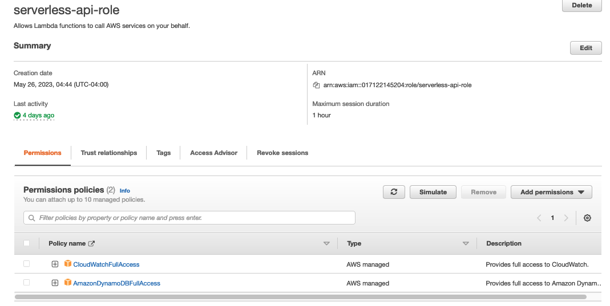

# CRUD Serverless API using Python, AWS Lambda and DynamoDB 

# Project Overview

This project is a serverless AWS Lambda function that serves as an API endpoint for managing a product inventory. It interacts with a DynamoDB table to perform operations such as retrieving products, saving new products, modifying existing products, and deleting products. I'll be using Postman as the client making request to the API. 

## Creating the DynamoDB Table 
The process begins with creating a DynamoDB table. After navigating to the DynamoDB dashboard (either by searching for "DynamoDB or clicking "Services" in the top left of the AWS management console selecting Database then finally, DynamoDB) I'll select Create Table.

I'll also give the table a name and partition key string for the productId and leave the defaults for the rest. 


## Creating an IAM role that uses AWS Lambda to access the database
In the IAM dashboard I'll select roles on the side menu then create role. For use cases I'll choose Lambda. As for permission policies I want to view CloudWatch Logs for the API requests so I'll add CloudWatchFullAccess and also DynamoDBFullAccess.

## Creating a AWS Lambda Function 
In the AWS Lambda dashboard I'll select create fuction making sure to author from scratch and that the Runtime is Python 3.10. I'll also select the IAM role that was just created as the execution role and finally create the function. In the general configuration menu I changed the default memory and time-out settings. 

## Creating an API Gateway to trigger the Lambda function
In the API Gateway dashboard I'll choose to build a REST API creating a new API with a regional endpoint. For resources I'll create a health resource and I'll also create resources for a single product and multiple products making sure to enable API Gateway CORS. Next I'll create a GET method for the health resource so that health checks can be performed from the client making sure to select lambda functino for intergration type, Lambda proxy intergration, and the Lambda function that I created. For the product resource another GET method will be created with the same settings as the health resource. Next a POST method is added so that a single product can be entered into the database from the client. The next method I'll create is a PATCH method for when a single item needs to be modififed and finally a DELETE method so that the client can remove an item from the database. For the products resource a GET method is created so the client can request all the products in the database. Now to make the API active I'll deploy the API with a new "prod" stage making note of the API invoke URL.  


## Writing the CRUD API Code in Python
The code begins by importing the necessary modules, including boto3 for interacting with AWS services, json for JSON serialization, and a custom encoder module.

```python
import boto3
import json
from custom_encoder import CustomEncoder
import logging

logger = logging.getLogger()
logger.setLevel(logging.INFO)
```
- Importing the required modules and setting up the logger with an `INFO` log level.

```python
dynamodbTableName = 'product-inventory-table'
dynamodb = boto3.resource('dynamodb')
table = dynamodb.Table(dynamodbTableName)
```
- Setting the DynamoDB table name as `product-inventory-table` and creating a DynamoDB resource and table object.

```python
getMethod = 'GET'
postMethod = 'POST'
patchMethod = 'PATCH'
deleteMethod = 'DELETE'
healthPath = '/health'
productPath = '/product'
productsPath = '/products'
```
- Defining variables to represent different HTTP methods (`GET`, `POST`, `PATCH`, `DELETE`) and different paths (`/health`, `/product`, `/products`).

```python
def lambda_handler(event, context):
    logger.info(event)
    httpMethod = event['httpMethod']
    path = event['path']
    if httpMethod == getMethod and path == healthPath:
        response = buildResponse(200)
    elif httpMethod == getMethod and path == productPath:
        response = getProduct(event['queryStringParameters']['productId'])
    elif httpMethod == getMethod and path == productsPath:
        response = getProducts()
    elif httpMethod == postMethod and path == productPath:
        response = saveProduct(json.loads(event['body']))
    elif httpMethod == patchMethod and path == productPath:
        requestBody = json.loads(event['body'])
        response = modifyProduct(requestBody['productId'], requestBody['updateKey'], requestBody['updateValue'])
    elif httpMethod == deleteMethod and path == productPath:
        requestBody = json.loads(event['body'])
        response = deleteProduct(requestBody['productId'])
    else:
        response = buildResponse(404, 'Not Found')

    return response
```
- Defining the `lambda_handler` function, which serves as the entry point for the AWS Lambda function.
- The function takes two parameters: `event` (representing the event data) and `context` (representing the execution context).
- The event data contains information about the HTTP request.
- The function logs the event using the logger.
- It extracts the `httpMethod` and `path` from the event.
- Based on the combination of `httpMethod` and `path`, different actions are taken:
  - If the HTTP method is `GET` and the path is `/health`, it calls the `buildResponse` function with a status code of 200.
  - If the HTTP method is `GET` and the path is `/product`, it calls the `getProduct` function with the `productId` extracted from the query string parameters.
  - If the HTTP method is `GET` and the path is `/products`, it calls the `getProducts` function.
  - If the HTTP method is `POST` and the path is `/product`, it calls the `saveProduct` function with the request body parsed as JSON.
  - If the HTTP method is `PATCH` and the path is `/product`, it calls the `modifyProduct` function with the `productId`, `updateKey`, and `updateValue` extracted from the request body.
  - If the HTTP method is `DELETE` and the path is `/product`, it calls the `deleteProduct` function with the `productId` extracted from the request body.
  - If none of the above conditions match, it calls the `buildResponse` function with a status code of 404 and a message of 'Not Found".
- The resulting response is returned.

```python
def getProduct(productId):
    response = table.get_item(Key={'productId': productId})
    if 'Item' in response:
        return buildResponse(200, response['Item'])
    else:
        return buildResponse(404, 'Product not found')
```
- The `getProduct` function retrieves a product item from the DynamoDB table based on the provided `productId`.
- It uses the `table.get_item` method to retrieve the item.
- If the item exists (`'Item'` key is present in the response), it returns a response with a status code of 200 and the item as the body.
- If the item doesn't exist, it returns a response with a status code of 404 and a message of 'Product not found'.

```python
def getProducts():
    response = table.scan()
    if 'Items' in response:
        return buildResponse(200, response['Items'])
    else:
        return buildResponse(404, 'No products found')
```
- The `getProducts` function retrieves all product items from the DynamoDB table.
- It uses the `table.scan` method to scan the entire table.
- If there are items (`'Items'` key is present in the response), it returns a response with a status code of 200 and the items as the body.
- If no items are found, it returns a response with a status code of 404 and a message of 'No products found'.

```python
def saveProduct(requestBody):
    table.put_item(Item=requestBody)
    return buildResponse(200, 'Product saved')
```
- The `saveProduct` function saves a product item to the DynamoDB table based on the provided `requestBody`.
- It uses the `table.put_item` method to insert the item into the table.
- It returns a response with a status code of 200 and a message of 'Product saved'.

```python
def modifyProduct(productId, updateKey, updateValue):
    updateExpression = f"set {updateKey} = :v"
    expressionAttributeValues = {':v': updateValue}
    table.update_item(
        Key={'productId': productId},
        UpdateExpression=updateExpression,
        ExpressionAttributeValues=expressionAttributeValues
    )
    return buildResponse(200, 'Product modified')
```
- The `modifyProduct` function modifies a product item in the DynamoDB table based on the provided `productId`, `updateKey`, and `updateValue`.
- It constructs an update expression and expression attribute values for the `table.update_item` method.
- It updates the item in the table using the `table.update_item` method.
- It returns a response with a status code of 200 and a message of 'Product modified'.

```python
def deleteProduct(productId):
    table.delete_item(Key={'productId': productId})
    return buildResponse(200, 'Product deleted')
```
- The `deleteProduct` function deletes a product item from the DynamoDB table based on the provided `productId`.
- It uses the `table.delete_item` method to delete the item.
- It returns a response with a status code of 200 and a message of 'Product deleted'.

```python
def buildResponse(statusCode, body=None):
    if body:
        response = {
            'statusCode': statusCode,
            'body': json.dumps(body, cls=CustomEncoder)
        }
    else:
        response = {
            'statusCode': statusCode
        }
    return response
```
- The `buildResponse` function constructs a response object with the provided status code and body.
- If a body is provided, it converts it to JSON using the `json.dumps` method and the `CustomEncoder` class to handle custom encoding.
- The resulting response object is returned.

To briefly explain the custom encoder: 
```python
import json
from decimal import Decimal

class CustomEncoder(json.JSONEncoder):
    def default(self, obj):
        if isinstance(obj, Decimal):
            return float(obj)
        return super().default(obj)
```
- The json module is imported, which provides functionality for working with JSON data.
- The Decimal class is imported from the decimal module. Decimal is a class for decimal arithmetic, often used for precise handling of decimal numbers.
- The CustomEncoder class is defined, inheriting from `json.JSONEncoder`. This class overrides the default method of the base class to customize the encoding behavior.
- In the default method, it takes an object `obj` as a parameter.
- The method checks if the `obj` is an instance of the Decimal class using the isinstance function.
- If `obj` is a Decimal instance, it converts it to a float using the float function and returns the result.
- If obj is not a Decimal instance, it calls the default method of the base class `(super().default(obj))` to handle encoding of other data types.
- This `CustomEncoder` class allows the JSON encoder to handle Decimal objects by converting them to float values during serialization.

Overall, this code defines a custom JSON encoder class that extends the functionality of the standard `json.JSONEncoder` by specifically handling Decimal objects during JSON serialization.

After writing the code I'll update the lambda function code.


## Testing the API with Postman

Now to test the funcitonality of the API with Postman I'll start by making a `GET` request the to the /health path that was set earlier. Noticing the status of `200` letting me know that the health check was successful.  

  

To test the `POST` method functionality I will enter in JSON product details including a productId, color, and price. The body shows a successful operation was returned with a `200` status. I can also go back to the table and check if the product was posted.  


  

Now to test modiffication functionality I'll update the product details with the `PATCH` method. A status of `200` is returned with the updated details of the product. I can also check within AWS to see if the table has been modified.  


  

Last I'll create two more items to test the delete fuctionality and also the ability to request all the products in the table.  

  

Now to test the delete method. A status of `200` is returned and I can also use AWS to test if the entry was deleted.  


  

Last the `GET` method for all products will be tested. A status of `200` is returned and all the products in the table are listed.  

